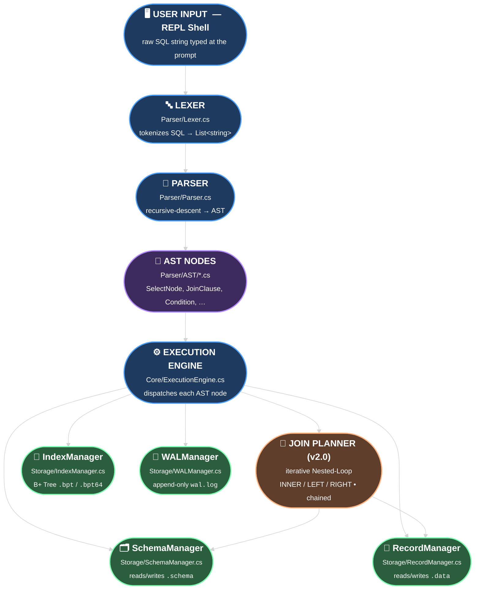

# 🦖 RaptorDB

> **Version 2.0** : A educational custom relational database engine built from scratch in C#.  
> Locked and Loaded just like a F22 raptor🦖. © 2025–2026 Prayas ([@captainprice27](https://github.com/captainprice27))
>
> **What's new in v2.0:** `INNER JOIN`, `LEFT JOIN`, `RIGHT JOIN`, and chained / multi-table JOIN support via the Nested-Loop algorithm — see [Joining Tables](#8-joining-tables-v20) and [Version History](#-version-history).

RaptorDB is a lightweight **Relational Database Management System (RDBMS)** designed to demonstrate advanced storage engine concepts. It features a custom SQL parser, a disk-based B+ Tree indexing engine, and an interactive REPL shell — all built **without any external database dependencies**.

---

## 📋 Table of Contents

- [Key Features](#-key-features)
- [Requirements](#-requirements)
- [Installation & Setup](#-installation--setup)
- [How to Run](#-how-to-run)
- [Data Types](#-data-types)
- [Command Reference](#-command-reference)
  - [Session Commands](#1-session-commands)
  - [Database Management](#2-database-management)
  - [Table Operations](#3-table-operations)
  - [Inserting Data](#4-inserting-data)
  - [Querying Data (SELECT)](#5-querying-data)
  - [Updating Data](#6-updating-data)
  - [Deleting Data](#7-deleting-data)
  - [Joining Tables (v2.0)](#8-joining-tables-v20)
  - [Sorting Results — ORDER BY (v2.0)](#9-sorting-results--order-by-v20)
- [Architecture](#-architecture)
- [Version History](#-version-history)
- [File Formats](#-file-formats)
- [Storage & Environment Config](#-storage--environment-config)
- [Future Scope (v2.x+)](#-future-scope-v2x)
- [Contributing](#-contributing)

---

## 🚀 Key Features

### 🧠 Core Engine
- **Custom Recursive Descent Parser** — Supports standard SQL syntax plus unique shorthand extensions
- **B+ Tree Indexing** — Disk-based B+ Tree for Primary Keys (4 KB paging) for **O(log n)** lookups
- **Typed Execution Engine** — Strictly enforces data types on every insert and update
- **Portable Storage** — Automatically adapts storage paths (local dev vs. cloud/Azure via env variable)

### 🔍 Advanced Querying
- **Range Queries** — Full support for `>`, `<`, `>=`, `<=`, and `!=` operators
- **Logic Chaining** — Chain multiple `AND` conditions in a single `WHERE` clause
- **Shorthand Syntax** — Unique syntax like `age > 18 AND < 25` (reuses column name)
- **BETWEEN Support** — Syntactic sugar for range lookups (`BETWEEN x AND y`)
- **JOIN Support (v2.0)** — `INNER`, `LEFT` and `RIGHT` joins via Nested-Loop, with qualified `table.column` references
- **Chained / Multi-table JOINs (v2.0)** — `A JOIN B JOIN C JOIN D ...` in a single statement, mixing INNER / LEFT / RIGHT freely
- **`ORDER BY` (v2.0)** — Stable, typed multi-key sort (`ORDER BY col1 ASC, col2 DESC`), works on both single-table and joined queries

### 🛡️ Data Integrity
- **Base64 Serialization** — All row data is Base64-encoded per field to prevent delimiter injection attacks
- **WAL (Write-Ahead Log)** — Every modification is logged to `wal.log` for full auditability
- **Duplicate PK Guard** — Automatically rejects inserts with duplicate primary keys
- **Safe Mode Writes** — Index and data files are updated separately to prevent partial-write corruption

---

## 💻 Requirements

| Requirement | Details |
|---|---|
| **IDE** | Visual Studio 2022+ (including VS 2026) |
| **Runtime** | .NET 8.0 or .NET 10.0 |
| **OS** | Windows (primary), Linux/macOS (via dotnet CLI) |
| **Dependencies** | `System.Configuration.ConfigurationManager` (NuGet — auto-restored) |

---

## 📦 Installation & Setup

**1. Clone the Repository**
```bash
git clone https://github.com/captainprice27/RaptorDB.git
```

**2. Open in Visual Studio**
- Open `RaptorDB.slnx` in Visual Studio 2022 or VS 2026

**3. Restore NuGet Packages**
- Visual Studio does this automatically on first build. Or run:
  ```bash
  dotnet restore
  ```

**4. Target Framework** (optional — supports both)

Edit `RaptorDB.csproj` to target a specific runtime or both:
```xml
<!-- .NET 8 only -->
<TargetFramework>net8.0</TargetFramework>

<!-- .NET 10 only -->
<TargetFramework>net10.0</TargetFramework>

<!-- Both (multi-targeting) -->
<TargetFrameworks>net8.0;net10.0</TargetFrameworks>
```

---

## ▶ How to Run

### Option A — Visual Studio (Recommended)
1. In **Solution Explorer**, right-click the `RaptorDB` project
2. Click **Set as Startup Project**
3. Press **F5** (Debug) or **Ctrl+F5** (Run without debugger)
4. A console window opens with the RaptorDB REPL shell

### Option B — dotnet CLI
```bash
cd path/to/RaptorDB
dotnet run
```

### What You'll See on Startup
```
[Storage] Data located at: C:\...\bin\Debug\net8.0\Databases
RaptorDB Locked and Loaded >> 🦖🦖🦖
© Prayas@captainprice27 2025-2026
Type 'exit'/'quit' to quit.

RaptorDB [default_db]>
```

The prompt dynamically shows the **currently active database** in brackets.

---

## 🗂️ Data Types

RaptorDB enforces strict typing. Use these types when defining columns:

| Type | Description | Example Value | Allowed as PK? |
|---|---|---|---|
| `INT` | 32-bit integer | `42`, `-5` | ✅ Yes |
| `LONG` | 64-bit integer | `9876543210` | ✅ Yes |
| `FLOAT` | Floating-point number | `3.14`, `99.9` | ❌ No |
| `STR` | Variable-length string | `"Alice"`, `"hello"` | ❌ No |
| `DATE` | Calendar date | `"2002-08-15"` | ✅ Yes |
| `DATETIME` | Date + time with ms | `"2024-01-01 10:30:00.00"` | ✅ Yes |

> **Note:** `BOOL` is listed in the README spec but is not yet fully implemented in `Validators.cs`. Use `INT` (0/1) as a workaround.

---

## 📖 Command Reference

> **General Rules:**
> - Commands are **case-insensitive** (`SELECT`, `select`, and `Select` all work)
> - Semicolons (`;`) are **optional** — the lexer strips them automatically
> - String values should be wrapped in **double or single quotes** (`"Alice"` or `'Alice'`)
> - Each table **must have exactly one** Primary Key column, declared with `pk`

---

### 1. Session Commands

These control the REPL shell itself.

| Command | Description |
|---|---|
| `exit` | Gracefully exit the RaptorDB shell |
| `quit` | Alias for `exit` |

```sql
exit
quit
```

---

### 2. Database Management

Databases are stored as **folders** inside the `Databases/` root directory.

#### `CREATE DATABASE`
Creates a new database (folder).
```sql
CREATE DATABASE school;
CREATE DATABASE company;
```

#### `USE`
Switches the active database context. All subsequent table operations apply to this DB.
```sql
USE school;
USE company;
```
The prompt updates to reflect the active DB: `RaptorDB [school]>`

#### `DROP DATABASE`
Permanently deletes a database and **all its tables**. A confirmation prompt appears.
```sql
DROP DATABASE school;
-- Prompt: "Are you sure you want to drop this database? (yes/no):"
```
> ⚠️ You **cannot** drop the currently active database. Switch to another DB first.

#### `CURRENT DATABASE`
Shows which database is currently active.
```sql
CURRENT DATABASE;
-- Output: Active Database: school
```

#### `LIST TABLES`
Lists all tables inside the currently active database.
```sql
LIST TABLES;
-- Output:
-- Tables in 'school':
--  📄 students
--  📄 courses
```

---

### 3. Table Operations

#### `CREATE TABLE`
Creates a new table with a defined schema. **Exactly one column must be marked as `pk`** (Primary Key).

**Syntax:**
```sql
CREATE TABLE <table_name> (
    <column_name> <TYPE> [pk],
    <column_name> <TYPE>,
    ...
);
```

**Examples:**
```sql
-- Simple student table
CREATE TABLE students (
    id   INT   pk,
    name STR,
    gpa  FLOAT,
    dob  DATE
);

-- Employee table with LONG pk
CREATE TABLE employees (
    emp_id   LONG  pk,
    name     STR,
    salary   FLOAT,
    joined   DATE
);

-- Event log with DATETIME
CREATE TABLE events (
    event_id  INT       pk,
    label     STR,
    occurred  DATETIME
);
```

> **Rules:**
> - Column names are lowercased internally (case-insensitive)
> - `pk` must be of type `INT`, `LONG`, `DATE`, or `DATETIME`
> - You cannot use `FLOAT` or `STR` as a primary key

#### `DROP TABLE`
Deletes the table schema, all its data, and its index files. A confirmation prompt appears.
```sql
DROP TABLE students;
-- Prompt: "Are you sure? (yes/no):"
```

---

### 4. Inserting Data

#### `INSERT INTO`
Inserts a single row into a table. Columns must match the schema, and types are validated.

**Syntax:**
```sql
INSERT INTO <table_name> (<col1>, <col2>, ...) VALUES (<val1>, <val2>, ...);
```

**Examples:**
```sql
-- Insert a student
INSERT INTO students (id, name, gpa, dob)
VALUES (101, "Aman Sharma", 3.8, "2002-08-15");

-- Insert with single quotes (also valid)
INSERT INTO students (id, name, gpa, dob)
VALUES (102, 'Priya Verma', 3.5, '2001-03-22');

-- Insert with LONG pk
INSERT INTO employees (emp_id, name, salary, joined)
VALUES (9876543210, "Rahul Kumar", 75000.50, "2023-06-01");
```

> **Duplicate PK Protection:** If you try to insert a row with an existing primary key value, the engine rejects it with:
> ```
> [Error] Duplicate primary key '101'.
> ```

---

### 5. Querying Data

RaptorDB supports rich `SELECT` queries with multiple filter types.

**Base Syntax:**
```sql
SELECT * FROM <table>;
SELECT <col1>, <col2> FROM <table> [WHERE <conditions>];
```

#### Basic SELECT (all rows)
```sql
-- All columns, all rows
SELECT * FROM students;

-- Specific column (note: multi-column select is a known v1.1 limitation)
SELECT name FROM students;
```

#### SELECT with WHERE (Equality)
```sql
SELECT * FROM students WHERE id = 101;
SELECT * FROM students WHERE name = "Alice";
```

#### Range Queries (`>`, `<`, `>=`, `<=`, `!=`)
Works on `INT`, `LONG`, `FLOAT`, `DATE`, and `DATETIME` columns.
```sql
-- Students with GPA 3.5 or above
SELECT * FROM students WHERE gpa >= 3.5;

-- Students born after year 2000
SELECT * FROM students WHERE dob > "2000-01-01";

-- Employees with salary not equal to 50000
SELECT * FROM employees WHERE salary != 50000;

-- GPA strictly less than 3.0
SELECT * FROM students WHERE gpa < 3.0;
```

#### BETWEEN (Range Sugar)
`BETWEEN x AND y` is equivalent to `>= x AND <= y`.
```sql
-- Students whose ID is between 100 and 200 (inclusive)
SELECT * FROM students WHERE id BETWEEN 100 AND 200;

-- GPA between 3.0 and 3.9
SELECT * FROM students WHERE gpa BETWEEN 3.0 AND 3.9;
```

#### Multiple AND Conditions
Chain multiple conditions using `AND`.
```sql
-- GPA > 3.0 AND GPA < 4.0 (standard form)
SELECT * FROM students WHERE gpa > 3.0 AND gpa < 4.0;

-- Two different columns
SELECT * FROM employees WHERE salary > 50000 AND joined > "2022-01-01";
```

#### Shorthand AND (Reuse Column Name)
RaptorDB's unique shorthand — omit the column name on the second condition when it's the same column.
```sql
-- Equivalent to: WHERE gpa > 3.0 AND gpa < 4.0
SELECT * FROM students WHERE gpa > 3.0 AND < 4.0;

-- Works with integers too
SELECT * FROM students WHERE id > 100 AND < 200;
```

---

### 6. Updating Data

#### `UPDATE ... SET ... WHERE`
Updates one or more rows that match the `WHERE` condition. Type validation is enforced on the new value.

**Syntax:**
```sql
UPDATE <table> SET <column> = <new_value> WHERE <condition>;
```

**Examples:**
```sql
-- Update GPA for a specific student
UPDATE students SET gpa = 4.0 WHERE id = 101;

-- Change a name
UPDATE students SET name = "Alice Smith" WHERE id = 101;

-- Adjust salary for all employees in a range
UPDATE employees SET salary = 80000 WHERE emp_id = 9876543210;
```

> **Note:** Currently `UPDATE` supports a single `SET` clause and a single `WHERE` condition. Multi-column updates are planned for v2.0.

---

### 7. Deleting Data

#### `DELETE FROM ... WHERE`
Deletes all rows that match the `WHERE` condition. If no `WHERE` is provided, **all rows are deleted** (use with caution).

**Syntax:**
```sql
DELETE FROM <table> WHERE <condition>;
DELETE FROM <table>;   -- Deletes ALL rows!
```

**Examples:**
```sql
-- Delete a specific student by PK
DELETE FROM students WHERE id = 101;

-- Delete all students with GPA below 2.0
DELETE FROM students WHERE gpa < 2.0;

-- Delete employees who joined before 2020
DELETE FROM employees WHERE joined < "2020-01-01";

-- WARNING: Deletes every row in the table
DELETE FROM students;
```

---

### 8. Joining Tables (v2.0)

RaptorDB v2.0 supports three join types — `INNER JOIN`, `LEFT JOIN`, and `RIGHT JOIN` — implemented via the **Nested-Loop** algorithm.

**Syntax:**
```sql
SELECT [* | col | table.col] [, ...]
FROM   <left_table>
[INNER | LEFT | RIGHT] JOIN <right_table>
  ON   <left_table>.<col> = <right_table>.<col>
[WHERE <conditions>];
```

> **About NULLs in RaptorDB:**
> RaptorDB does **not** store NULLs — every column is type-validated on `INSERT` / `UPDATE`. This does **not** prevent `LEFT` / `RIGHT` joins, because joins are read-only projections. For unmatched rows, the missing side's columns are filled with the literal `<NULL>` placeholder **only in the `SELECT` output** — nothing is ever written to disk.

#### Setup (used in all examples below)
```sql
CREATE TABLE students (
    id   INT pk,
    name STR
);
CREATE TABLE courses (
    course_id  INT pk,
    student_id INT,
    title      STR
);

INSERT INTO students (id, name) VALUES (1, "Alice");
INSERT INTO students (id, name) VALUES (2, "Bob");
INSERT INTO students (id, name) VALUES (3, "Carol");

INSERT INTO courses (course_id, student_id, title) VALUES (101, 1, "Algorithms");
INSERT INTO courses (course_id, student_id, title) VALUES (102, 1, "Databases");
INSERT INTO courses (course_id, student_id, title) VALUES (103, 2, "Networks");
INSERT INTO courses (course_id, student_id, title) VALUES (104, 99, "Orphan Course");
```

#### `INNER JOIN`
Returns only rows where the join key matches in **both** tables. A bare `JOIN` is treated as `INNER JOIN` (SQL standard).
```sql
SELECT * FROM students
INNER JOIN courses ON students.id = courses.student_id;

-- Equivalent shorthand:
SELECT * FROM students JOIN courses ON students.id = courses.student_id;

-- Project specific columns
SELECT students.name, courses.title FROM students
INNER JOIN courses ON students.id = courses.student_id;
```

#### `LEFT JOIN`
Returns **all rows from the left table**; right-side columns become `<NULL>` when there is no match.
```sql
SELECT * FROM students
LEFT JOIN courses ON students.id = courses.student_id;
-- Carol (id=3) has no courses → her row's courses.* columns appear as <NULL>
```

#### `RIGHT JOIN`
Returns **all rows from the right table**; left-side columns become `<NULL>` when there is no match.
```sql
SELECT * FROM students
RIGHT JOIN courses ON students.id = courses.student_id;
-- The "Orphan Course" (student_id=99) appears with students.* as <NULL>
```

#### JOIN + `WHERE`
`WHERE` is applied **after** the join. References can be qualified or — when unambiguous — bare.
```sql
SELECT students.name, courses.title FROM students
INNER JOIN courses ON students.id = courses.student_id
WHERE students.id = 1;

-- Bare column names work when only one side has that column
SELECT * FROM students
INNER JOIN courses ON students.id = courses.student_id
WHERE title = "Databases";
```

> **Limitations:**
> - The `ON` clause supports equi-joins only (`=`); range/composite predicates are not yet implemented.
> - Multi-column projection (e.g. `SELECT a, b`) on **non-join** queries is still subject to the v1.3 single-column display limitation; for joined queries (any number of tables) it works as documented above.

---

#### Chained / Multi-table JOINs (v2.0)

v2.0 also supports chained joins. You can chain any number of `JOIN ... ON ...` clauses in a single `SELECT`, and freely mix join types. Each `ON` clause can reference any table that appeared earlier in the chain (the `FROM` table or any previously-joined table).

**Syntax:**
```sql
SELECT [* | col | table.col | table.*] [, ...]
FROM   <t1>
[INNER|LEFT|RIGHT] JOIN <t2> ON <expr1>
[INNER|LEFT|RIGHT] JOIN <t3> ON <expr2>
[INNER|LEFT|RIGHT] JOIN <t4> ON <expr3>
...
[WHERE <conditions>];
```

#### Setup (3-table chain)
```sql
CREATE TABLE students    (id INT pk, name STR);
CREATE TABLE enrollments (enrol_id INT pk, student_id INT, course_id INT);
CREATE TABLE courses     (course_id INT pk, title STR);

INSERT INTO students    (id, name)                        VALUES (1, "Alice");
INSERT INTO students    (id, name)                        VALUES (2, "Bob");
INSERT INTO enrollments (enrol_id, student_id, course_id) VALUES (10, 1, 100);
INSERT INTO enrollments (enrol_id, student_id, course_id) VALUES (11, 1, 101);
INSERT INTO enrollments (enrol_id, student_id, course_id) VALUES (12, 2, 100);
INSERT INTO courses     (course_id, title)                VALUES (100, "Algorithms");
INSERT INTO courses     (course_id, title)                VALUES (101, "Databases");
```

#### Three-table INNER JOIN
Resolve students → enrollments → courses to get "who is taking what":
```sql
SELECT students.name, courses.title
FROM students
INNER JOIN enrollments ON students.id        = enrollments.student_id
INNER JOIN courses     ON enrollments.course_id = courses.course_id;
```

#### Mixing INNER + LEFT (4 tables)
You can mix join types in a single chain. Each step is evaluated against the running result set:
```sql
SELECT students.name, courses.title, grades.letter
FROM students
INNER JOIN enrollments ON students.id        = enrollments.student_id
INNER JOIN courses     ON enrollments.course_id = courses.course_id
LEFT  JOIN grades      ON enrollments.enrol_id = grades.enrol_id;
-- Students with no recorded grade still appear; grades.letter shows <NULL>.
```

#### Chained JOINs + WHERE
The `WHERE` clause runs **after** all joins and can reference any table in the chain:
```sql
SELECT students.name, courses.title
FROM students
INNER JOIN enrollments ON students.id        = enrollments.student_id
INNER JOIN courses     ON enrollments.course_id = courses.course_id
WHERE students.id = 1;

-- table.* shorthand also works for chained joins
SELECT students.*, courses.title
FROM students
INNER JOIN enrollments ON students.id        = enrollments.student_id
INNER JOIN courses     ON enrollments.course_id = courses.course_id
WHERE courses.title = "Algorithms";
```

> **How it works under the hood:**
> The execution engine performs an **iterative Nested-Loop** — it starts with the `FROM` table's rows (qualified as `table.column`), then for each `JOIN` clause it does a single Nested-Loop step against the new table and replaces the running result set. After all joins are resolved, the `WHERE` filter and column projection run against the fully-qualified rows.

> **Limitations (v2.0):**
> - `ON` is still equi-only (`=`).
> - Each `JOIN` has its own `ON` clause directly after it (SQL standard ordering); composite `ON` predicates with `AND` are planned for a future release.

---

### 9. Sorting Results — `ORDER BY` (v2.0)

RaptorDB v2.0 adds full `ORDER BY` support — **single or multi-key**, **`ASC` / `DESC`** per key, with **typed comparisons** (numbers sort numerically, dates chronologically, strings lexically).

**Syntax:**
```sql
SELECT ... FROM <table>
[WHERE <conditions>]
ORDER BY <col1> [ASC|DESC] [, <col2> [ASC|DESC] ...];
```

If `ASC` / `DESC` is omitted, the default is **`ASC`** (SQL standard).

#### Examples
```sql
-- Single-column sort, ascending (default)
SELECT * FROM students ORDER BY gpa;

-- Single-column sort, descending
SELECT * FROM students ORDER BY gpa DESC;

-- Multi-key sort: GPA descending, then name ascending as tie-breaker
SELECT * FROM students ORDER BY gpa DESC, name ASC;

-- Combine WHERE + ORDER BY
SELECT * FROM students
WHERE gpa >= 3.0
ORDER BY dob ASC;

-- Works with JOINs (qualified references, mix of tables)
SELECT students.name, courses.title FROM students
INNER JOIN courses ON students.id = courses.student_id
ORDER BY students.name ASC, courses.title DESC;
```

> **NULL ordering:** `<NULL>` placeholders produced by `LEFT` / `RIGHT` joins always sort **last**, matching PostgreSQL's `NULLS LAST` default for `ASC`.

#### Algorithm — Stable Merge Sort

`ORDER BY` is implemented on top of LINQ's `OrderBy` / `ThenBy` chain, which the .NET BCL realises as a **stable comparison sort** based on **merge sort**.

| Property | Value | Why it matters |
|---|---|---|
| **Time complexity** | **`O(n log n)`** in the average and worst case (`O(k · n log n)` for `k` sort keys) | Performance never degrades to quadratic, even on adversarial inputs |
| **Space complexity** | **`O(n)`** — the result set is materialised into an array once and sorted in place | Memory grows linearly with row count |
| **Stability** | ✅ Stable | Equal-key rows preserve their relative input order — this is what makes multi-key sort (`a ASC, b DESC`) behave correctly |
| **Comparison kind** | Typed (`INT`, `LONG`, `FLOAT`, `DATE`, `DATETIME`, `STR`) | `"10"` sorts after `"9"` (numeric), not before (lexical) |

> **Why merge sort over quicksort here?** RaptorDB needs **stability** for multi-key sort to work — running `ORDER BY b ASC` first and then `ORDER BY a ASC` only yields the desired (`a ASC, b ASC`) ordering when the second pass preserves the relative order of equal-`a` rows. Merge sort guarantees this; classical quicksort does not. The trade-off is `O(n)` extra memory, which is acceptable for an in-memory result set.

> **Limitations (v2.0):**
> - Sort runs on the materialised, post-`WHERE` result set — there is no index-based sort yet (a future B+ Tree-backed `ORDER BY` is planned).
> - Sort happens **before** column projection, so you can `ORDER BY` a column that you didn't include in the `SELECT` list.

---

## 🏗️ Architecture

RaptorDB follows a clean **Separation of Concerns** pipeline. The diagram below grows **top-down** so each stage gets full-width labels and the storage fan-out at the bottom stays readable.



<details>
<summary><b>📜 Plain-text fallback (for environments that don't render Mermaid)</b></summary>

```
User Input (REPL)
     │
     ▼
  Lexer                (Parser/Lexer.cs)
  Tokenizes raw SQL string → List<string> tokens
     │
     ▼
  Parser               (Parser/Parser.cs)
  Builds Abstract Syntax Tree (AST) from tokens
     │
     ▼
  AST Nodes            (Parser/AST/*.cs)
  Typed representation of each SQL statement
     │
     ▼
  ExecutionEngine      (Core/ExecutionEngine.cs)
  Dispatches AST nodes to storage layer
     │
     ├── JoinPlanner   (v2.0 INNER/LEFT/RIGHT + chained Nested-Loop)
     ├── SchemaManager (Storage/SchemaManager.cs)  → reads/writes .schema files
     ├── RecordManager (Storage/RecordManager.cs)  → reads/writes .data files
     ├── IndexManager  (Storage/IndexManager.cs)   → manages .bpt B+ Tree index
     └── WALManager    (Storage/WALManager.cs)     → appends to wal.log
```

</details>

### Key Design Decisions

| Decision | Rationale |
|---|---|
| Recursive Descent Parser | Flexible, human-readable, easy to extend with new syntax |
| B+ Tree on PK only | O(log n) duplicate-key detection at INSERT time |
| Base64 per-field encoding | Prevents `\|` or `=` inside data values from corrupting the row format |
| WAL as append-only text | Simple, auditable, human-readable audit trail |
| Env variable for path | Allows zero-code-change deployment to Azure/cloud |

---

## 📂 File Formats

All data is stored as **plain files** in the active database folder (`Databases/<db_name>/`).

| Extension | File Type | Format / Notes |
|---|---|---|
| `.schema` | Table definition | One line per column: `colname:TYPE:PK` (PK is empty string if not PK) |
| `.data` | Row storage | One row per line; pipe-delimited `col=Base64Value` pairs |
| `.bpt` | INT primary key index | Binary B+ Tree, 4096-byte pages |
| `.bpt64` | LONG/DATE/DATETIME PK index | Binary B+ Tree, 64-bit key variant |
| `wal.log` | Write-Ahead Log | Append-only text: `timestamp\|ACTION\|table\|details` |

**Example `.schema` file** for a `students` table:
```
id:INT:PK
name:STR:
gpa:FLOAT:
dob:DATE:
```

**Example `wal.log` entries:**
```
2025-12-27T14:30:01|INSERT|students|101
2025-12-27T14:30:45|UPDATE|students|gpa=4.0
2025-12-27T14:31:10|DELETE|students|Removed 2 rows
```

---

## ⚙️ Storage & Environment Config

### Default Storage Path

When running locally (debug or `dotnet run`), data is stored at:
```
<project_root>/bin/Debug/net8.0/Databases/
```
A `default_db` folder is automatically created here on first startup.

### Override Path (Cloud / Azure / Custom)

Set the `RAPTOR_DB_PATH` environment variable to redirect all storage:

**PowerShell (current session):**
```powershell
$env:RAPTOR_DB_PATH = "C:\MyDatabases\RaptorDB"
dotnet run
```

**System-wide (Windows):**
```text
Control Panel → System → Advanced system settings
→ Environment Variables → New → RAPTOR_DB_PATH = <your path>
```

When set, the engine prints:
```
[Storage] Data located at: C:\MyDatabases\RaptorDB
```

---

## 📜 Version History

| Version | Highlights |
|---|---|
| **v2.0** *(current)* | ➕ `INNER JOIN`, `LEFT JOIN`, `RIGHT JOIN`, and **chained / multi-table JOINs** via Nested-Loop algorithm.<br>➕ Qualified column references (`table.column`) in `SELECT`, `WHERE` and `ON`.<br>➕ Each `ON` clause may reference **any previously-joined table**, not just the immediate predecessor.<br>➕ `<NULL>` output placeholder for unmatched rows in `LEFT` / `RIGHT` joins (output-only — nothing written to disk).<br>➕ `JoinClause` AST node + Parser support for `[INNER\|LEFT\|RIGHT] [OUTER] JOIN ... ON ...`.<br>➕ `SelectNode` now carries a `List<JoinClause>` so chained joins can be parsed and executed iteratively.<br>➕ **`ORDER BY` clause** with `ASC` / `DESC` and multi-key support (`ORDER BY a DESC, b ASC`); typed comparisons, stable merge sort (`O(n log n)` time / `O(n)` space), works on both single-table and joined queries.<br>➕ Architecture diagram switched to **Mermaid (top-down)** for readable, large-text rendering. |
| **v1.3** | ➕ Migration to **.NET 10** (multi-target with .NET 8).<br>➕ `BOOL` data type fully implemented in `Validators.cs`.<br>➕ Culture-invariant numeric parsing (no more locale-dependent FLOAT bugs).<br>➕ Span-based Base64 encode/decode in `ByteSerializer` for fewer allocations.<br>➕ `RAPTOR_DB_PATH` environment variable for portable / cloud-ready storage.<br>➕ Hardened nullable-reference flow in the Parser (`Require()` helper). |
| **v1.2** | ➕ Disk-based **B+ Tree** index (`.bpt` / `.bpt64`) for primary keys with 4 KB paging.<br>➕ Duplicate-PK detection at `INSERT` time in O(log n).<br>➕ `WALManager` (`wal.log`) for append-only audit trail of every mutation.<br>➕ `LONG`, `DATE`, `DATETIME` allowed as primary keys. |
| **v1.1** | ➕ Range operators (`>`, `<`, `>=`, `<=`, `!=`) and `BETWEEN x AND y`.<br>➕ Multiple chained `AND` conditions in `WHERE`.<br>➕ Shorthand `WHERE gpa > 3.0 AND < 4.0` (reuse previous column).<br>➕ Base64 per-field row encoding to prevent delimiter injection. |
| **v1.0** | ➕ Initial release: REPL shell, custom Lexer + recursive-descent Parser.<br>➕ `CREATE/DROP DATABASE`, `USE`, `LIST TABLES`, `CREATE/DROP TABLE`.<br>➕ `INSERT`, `SELECT * / col`, equality `WHERE`, `UPDATE`, `DELETE`.<br>➕ Strict typed schema (`INT`, `LONG`, `FLOAT`, `STR`, `DATE`, `DATETIME`). |

---

## 🔮 Future Scope (v2.x+)

| Feature | Description | Status |
|---|---|---|
| **JOIN Support** | `INNER`, `LEFT`, `RIGHT` joins via Nested-Loop | ✅ Done in v2.0 |
| **Multi-table / chained JOINs** | `A JOIN B JOIN C ON ...` | ✅ Done in v2.0 |
| **Composite `ON` predicates** | `ON a.x = b.x AND a.y = b.y` | 🔵 Planned |
| **Non-equi JOINs** | Range / composite predicates in `ON` clause | 🔵 Planned |
| **ACID Transactions** | `BEGIN`, `COMMIT`, `ROLLBACK` backed by the existing WAL | 🔵 Planned |
| **Secondary Indexes** | `CREATE INDEX ON table(col)` for non-PK columns | 🔵 Planned |
| **Query Optimizer** | Wire up `QueryPlanner.cs` to choose Index Seek vs. Full Scan | 🔵 Planned |
| **`ORDER BY`** | Sort result set by any column, ASC or DESC | ✅ Done in v2.0 |
| **`LIMIT`** | Restrict query result to top N rows | 🔵 Planned |
| **`OR` Conditions** | Support `WHERE col = x OR col = y` | 🔵 Planned |
| **Multi-column `UPDATE`** | `UPDATE t SET a=1, b=2 WHERE ...` | 🔵 Planned |
| **Network / TCP Mode** | Expose engine via socket for remote or GUI clients | 🔵 Planned |
| **Cloud Deployment**   | Cloud-ready deployment (Azure/AWS) planned for v3.x | 🔵 Planned |
| **CSV Import/Export** | `EXPORT table TO "file.csv"` / `IMPORT INTO table FROM "file.csv"` | 🔵 Planned |
| **`LIST DATABASES`** | Show all available databases at the REPL | 🔵 Planned |
| **`HELP` Command** | Built-in command reference in the REPL | 🔵 Planned |

---

## 🤝 Contributing

Contributions are most welcome! Please please fork the repo and create a Pull Request for review.

```bash
# 1. Fork the project on GitHub

# 2. Create your Feature Branch
git checkout -b feature/NewFeature

# 3. Commit your Changes
git commit -m "Add: NewFeature description"

# 4. Push to the Branch
git push origin feature/NewFeature

# 5. Open a Pull Request on GitHub
```

---

<div align="center">

Built with 🦖 & C# by **Prayas** ([@captainprice27](https://github.com/captainprice27))

*"Small in size, Raptorous in speed."*

</div>